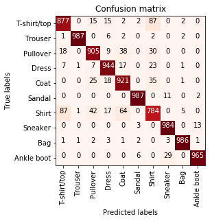
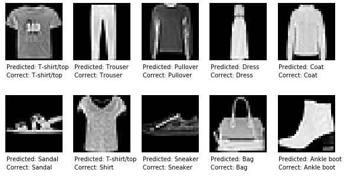
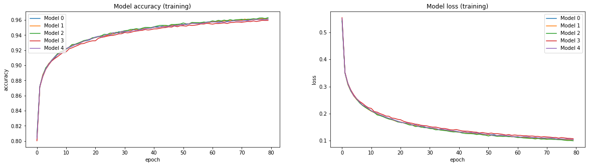
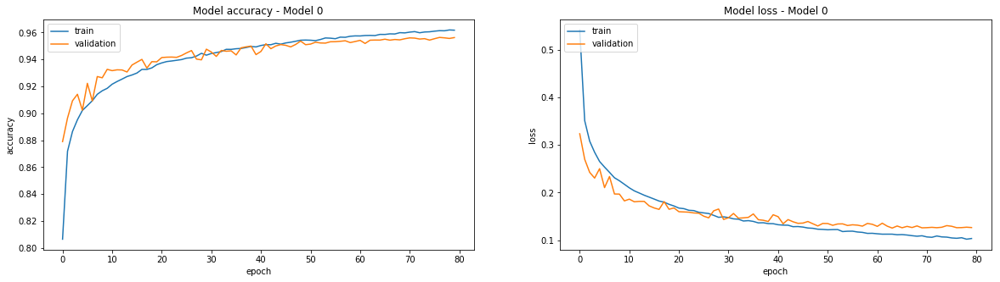

# Image classification on fashion-MNIST
Author: Christopher Masch

I would like to share my results (93.43% accuracy / avg) on the [fashion-MNIST](https://github.com/zalandoresearch/fashion-mnist) dataset. You can find further informations about the dataset on [Zalando Research](https://github.com/zalandoresearch/fashion-mnist) and [Kaggle](https://www.kaggle.com/zalando-research/fashionmnist)
This dataset is a great option instead of traditional handwritten MNIST. 
Thanks to [Han](https://github.com/hanxiao) and [Kashif](https://github.com/kashif)!

## Requirements
- [Anaconda](https://www.continuum.io/downloads)
- [Keras 2.0](https://keras.io/)
- [OpenCV 3.0](http://opencv.org/)
- [TensorFlow 1.1](https://www.tensorflow.org/)

## Evaluation procedure
I splitted the training data randomly in train (80%) and validation (20%). The testset of 10k images are used for final evaluation. I created 5 models with the same architecture but with random train/validation data. I only saved the weights of every model with best loss. Finally I used the models to evaluate them on the testset. The average loss/accuracy of the 5 models is the final result. 
Furthermore I evaluate the generalization of the network for classifying traditional MNIST at the end.

## Results
Actually I'm focussed on a very simple architecture with less than 500,000 parameter which could run on CPU with 4GB memory. If you are interested in further results, you can find them on [Zalando benchmark](https://github.com/zalandoresearch/fashion-mnist#benchmark). If it fits in time, I will evaluate architectures e.g. DenseNet.

I'm just using two convolutional layers, batchnorm, dropout and three fully connected layers. For a detailed implementation check the model definition in the [jupyter notebook](https://github.com/cmasch/zalando-fashion-mnist/blob/master/Simple_Convolutional_Neural_Network_Fashion-MNIST.ipynb). 
This is the summary of the current model: 
<kbd></kbd>

It's easy to reach an accuracy over 90% but around 92% it stucks very fast. If we take a look on the confusion matrix, we will find out that distinguishing between Shirt and T-Shirt/top is very difficult: 

Here's an example where my model fails. I'm not a fashion expert. Maybe thats the reason why i don't see any difference. If you could explain why this is a shirt and not a t-shirt I would appreciate it:

Another two plots which illustrate the accuracy / loss of training and validation over the time: 
<kbd> 
</kbd>

And a detailed plot of iteration 0: 
<kbd></kbd>

The model reached 93.43% accuracy and 0.2149 loss on testset. 
Scores for training: 0.1066 loss / 95.99% accuracy. 
Scores for validation: 0.1245 loss / 95.64% accuracy.

If you like, you can [download](https://github.com/cmasch/zalando-fashion-mnist/tree/master/models/simple_cnn) the saved models/weights and history.

#### MNIST
I used the same architecture of neural network to train on traditional MNIST. 
The model reached 99.43% accuracy and 0.0248 loss on testset. 
Scores for training: 0.078 loss / 99.74% accuracy. 
Scores for validation: 0.161 loss / 99.61% accuracy.

In the plot below you can track training / validation for MNIST:
<kbd></kbd>

### Overview

| Fashion-MNIST test accuracy | Fashion-MNIST train accuracy | Fashion-MNIST validation accuracy | MNIST  test accuracy | Add. Settings | Trainable Params |
| :---: | :---: | :---: | :---: | --- | :---: |
| 93.43% | 95.99% | 95.64% | 99.43% | BatchSize : 250  Epochs : 80  Data augmentation (2x) | 493,772

If you have any questions or hints contact me through an [issue](https://github.com/cmasch/zalando-fashion-mnist/issues). Thanks!

## References
[1] [Fashion-MNIST](https://github.com/zalandoresearch/fashion-mnist) 
[2] [Fashion-MNIST: a Novel Image Dataset for Benchmarking Machine Learning Algorithms](https://arxiv.org/abs/1708.07747)
